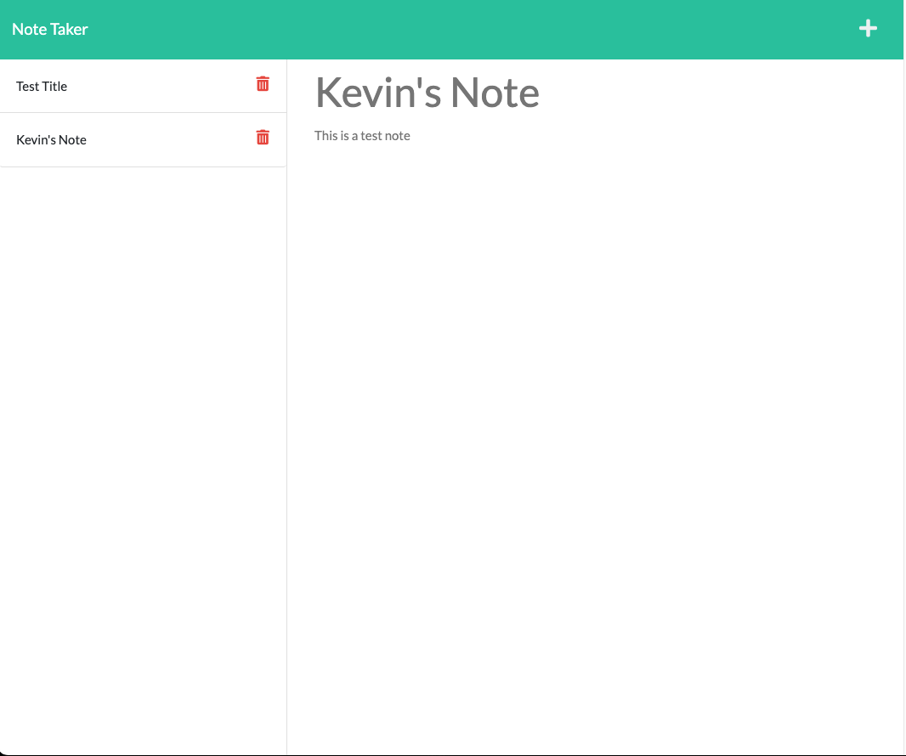

# Note Taker 

## User Story 

-AS A small business owner  
-I WANT to be able to write and save notes  
-SO THAT I can organize my thoughts and keep track of tasks I need to complete  

## Description 

-Note taker that stores notes in a database  

## Built With 

-Javascript  
-Node.js  
-HTML  
-Bootstrap  
-CSS  

## Installation  

`npm i express`  

## Usage  

-Open app via link below to start taking notes  

## Heroku Link

-https://note-taker-kevin.herokuapp.com/  

## License  

## Screenshot/Video  

## Questions 

-Github: https://github.com/Doolittle28  

****
